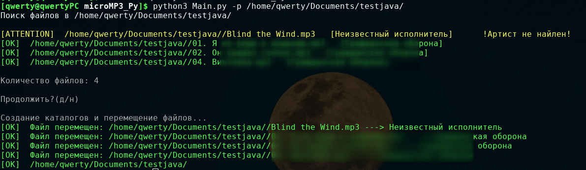
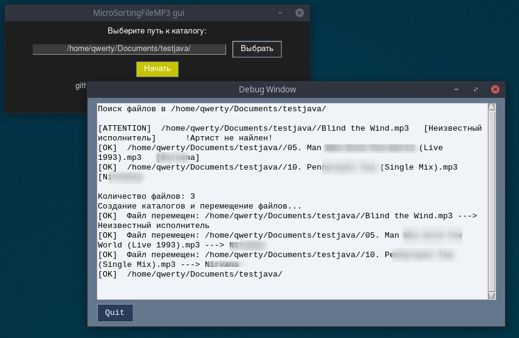

# MicroSortingFileMP3_Py

## О пограмме
Python версия ___MicroSortingFileMP3___ была разаботана для автоматизированного сортирования (по имени автора или названии группы) аудио файлов формата mp3. 
Есть две версии UI: 
- [Консольная](#cl);



- [Графическая](#gr).




***
## Установа 

1. Устанавливаем [python](https://www.python.org/).

2.  Устанвливаем pip.

- Ubuntu:

```
$ sudo apt install pip
```

- Arch:

```
$ pacman -S python-pip
```


3.  Устанавливаем нужные для работоспосоробности библеотеки.

```
$ pip install pysimplegui
$ pip install colorama
$ pip install eyed3
$ pip install argparse
``` 

4. Ставим tkinter
- Ubuntu:

```
$ sudo apt-get install python3-tk
```

- Arch:

```
$ sudo pacman -S tk
```


5. Скачиваним с  репозитория github файлы программы.

``` 
$ git clone  https://github.com/Zunder45/MicroSortingFileMP3_Py.git 
$ cd microMP3_Py // переходим в директорию программы
```

## Запуск

Запуск происходит через файл Main.py (графика и консоль) или Console version/Main.py (без зависимостей к tkinter и pysimplegui).


<p id="cl">Запуск консольной версии:</p>

```
$ python3 Main.py 
или 
$ python3 Console version/Main.py 
```

<p id="gr">Запуск графической версии:</p>

```
$ python3 Main.py -g   //или --gui
```

***
Сортировка файлов происходи в том каталоге, где находится программы или с помощью аргумента **(-p)** можно указать точное местоположение каталога.

```
$ python3 Main.py -p *Путь*
```

Если добавть **-p** к **-g**, то путь указанный в консоле будет указан в поле ввода пути к каталогу.


