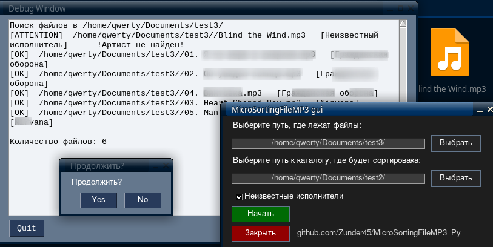

# MicroSortingFileMP3_Py

## О пограмме
___MicroSortingFileMP3___ была разаботана для автоматизированного сортирования (по имени исполнителя) аудио файлов формата mp3. 

Есть две версии UI: 
- [Консольная](#cl);


- [Графическая](#gr).




***
## Установа 

1. Устанавливаем [python](https://www.python.org/).

2.  Устанвливаем pip.

- Ubuntu:

```sh
sudo apt install pip
```

- Arch:

```sh
pacman -S python-pip
```


3.  Устанавливаем нужные для работоспосоробности библеотеки.

Для графической версии

```sh
pip install pysimplegui
```

Для консольной и графиеской

```sh
pip install colorama; pip install eyed3; pip install argparse;
``` 

4. Ставим **tkinter** (Для графической версии)
- Ubuntu:

```sh
sudo apt-get install python3-tk
```

- Arch:

```sh
sudo pacman -S tk
```


5. Скачиваним с  репозитория github файлы программы.

``` sh
git clone https://github.com/Zunder45/MicroSortingFileMP3_Py.git 
```

6. Переходим в директорию программы

```sh
cd MicroSortingFileMP3_Py 
```

## Запуск

<h3 id="cl"> Запуск консольной версии</h3>

Запуск происходит через файл **main.py** (графика и консоль) или в каталоге clear_console **main.py** (без зависимостей к tkinter и pysimplegui).

```sh
python3 main.py 
```

или 

```sh
cd clear_console

python3 main.py
```

<h3 id="gr">Запуск графической версии:</h3>

Запуск происходит через файл main.py с аргументом `-g` (`--gui`) или gui_main.py (только графика)

```sh
python3 main.py -g 
```
или 

```sh
python3 gui.py
```

***
## Аргументы

Сортировка файлов происходи в рабочем каталоге (там откуда запущена программа) или с помощью аргумента `-p` можно указать точное местоположение каталога.

```sh
python3 main.py -p *Путь*
```

Аргумент `-f`  принимает в себя путь, того кталога, от куда будут браться файлы для перемещения в рабочий каталог или указаный аргументом `-p`.

```sh
python3 main.py -f *Путь к файлам* -p *Путь куда будут перемещены и сортированы файлы*
```

Если добавить `-p` или `-f` к `-g`, то путь указанный в консоле будет указан в поле ввода пути к каталогу.

```sh
python3 main.py -gp *Путь*
```

Если дать аргументу символ `?`, то откроется окно выбора каталога. 

```sh
python3 main.py -p ? -f ?
```


## Остальные аргументы

|Аргумент|Описание|
|:--------:|--------|
|**-u**  | Брать файлы без имени исполнителя (они будут перемещены в каталог       "Неизвестный исполнитель")|
|**-s**  | Пропускает сообщение о продолжении|
|**--nocolor**|Уберает цвет текста|


